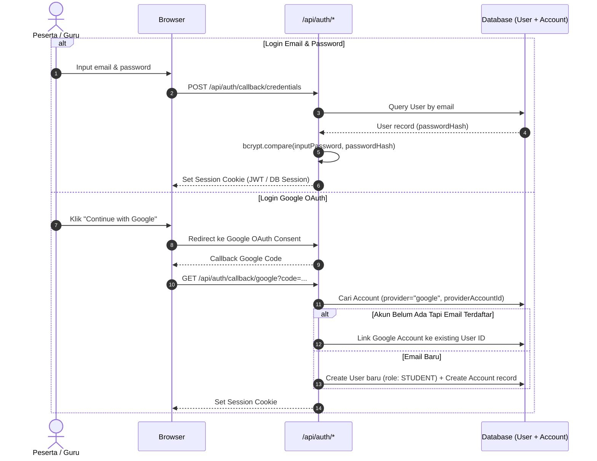
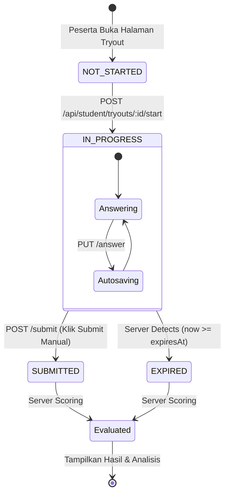

# BLUEPRINT 02: CORE ENGINE & API SPECIFICATION

**Project:** TryoutKu (Tryout Platform)  
**Version:** 0.1.0 (MVP)  
**Type:** Technical Engine & API Contract  
**Reference:** [BLUEPRINT 00.md](file:///mnt/data/VibeCoding/tryout-ku/BLUEPRINT%2000.md) & [BLUEPRINT 03 - DATABASE DESIGN & ERD.md](file:///mnt/data/VibeCoding/tryout-ku/BLUEPRINT%2003%20-%20DATABASE%20DESIGN%20&%20ERD.md)

---

## 1. Arsitektur Teknis & Prinsip Engine

Aplikasi dibangun menggunakan model **Modular Monolith** berbasis **Next.js (App Router)**:
1. **Zero-Trust Client:** Browser hanya berperan sebagai antarmuka presentasi. Otoritas waktu, validasi status ujian, dan kalkulasi nilai sepenuhnya ditentukan oleh server.
2. **Kerahasiaan Konten Ujian:** Selama ujian berstatus `IN_PROGRESS`, server **dilarang keras** mengirimkan kunci jawaban (`isCorrect`) dan teks pembahasan (`explanation`) ke client (bahkan via response JSON/Network inspector).
3. **Idempotent Submission:** Permintaan submit ujian berkali-kali (akibat spam klik atau lag jaringan) tidak boleh menghasilkan duplikasi kalkulasi nilai atau merusak status sesi.
4. **Resilient Autosave:** Setiap perpindahan/pemilihan opsi langsung disimpan ke server secara *asynchronous* tanpa memblokir interaksi pengguna di layar.

---

## 2. Authentication & Security Specification

### 2.1 Mekanisme Login & Account Linking
Sistem mengadopsi standar **NextAuth.js / Auth.js (v5)**:



### 2.2 Role-Based Access Control (RBAC) Middleware
Setiap request diproteksi oleh middleware Next.js (`middleware.ts`) berdasarkan session role:

| Endpoint Pattern | Role yang Diizinkan | Tindakan jika Unauthorized |
| :--- | :--- | :--- |
| `/api/student/*` | `STUDENT`, `ADMIN` | 403 Forbidden |
| `/api/teacher/*` | `TEACHER`, `ADMIN` | 403 Forbidden |
| `/api/admin/*` | `ADMIN` | 403 Forbidden |
| `/dashboard/student/*` | `STUDENT`, `ADMIN` | Redirect `/auth/login` |
| `/dashboard/teacher/*` | `TEACHER`, `ADMIN` | Redirect `/dashboard/student` |
| `/dashboard/admin/*` | `ADMIN` | Redirect `/dashboard/student` |

---

## 3. Exam Engine Specification (Logika Inti Ujian)

### 3.1 State Machine Sesi Ujian (`ExamSession`)



### 3.2 Aturan Sinkronisasi Waktu Server
1. **Perhitungan Waktu Berakhir:**
   $$\text{expiresAt} = \text{startedAt} + (\text{durationMinutes} \times 60 \times 1000)$$
2. **Kalkulasi Sisa Waktu Saat Klien Melakukan Request:**
   $$\text{remainingSeconds} = \max\left(0, \left\lfloor \frac{\text{expiresAt} - \text{now()}}{1000} \right\rfloor\right)$$
3. **Grace Period (Toleransi Jaringan):**
   * Server memberikan toleransi tambahan sebesar **15 detik** untuk mengantisipasi *latency* pengiriman paket saat detik-detik terakhir.
   * Jika $\text{now()} > \text{expiresAt} + 15\text{s}$, permintaan autosave jawaban ditolak dengan error `400 EXAM_SESSION_EXPIRED`.

### 3.3 Sanitasi Payload Soal (Anti-Bocor Kunci Jawaban)
Saat endpoint `GET /api/student/exam-sessions/:id` dipanggil:
* Field `isCorrect` pada tabel `question_options` **DIHAPUS** dari response JSON.
* Field `explanation` dan `explanationImageUrl` pada tabel `questions` **DIHAPUS**.
* Response hanya berisi: ID soal, teks soal, opsi jawaban (ID, label A–E, teks opsi), status jawaban yang tersimpan, dan sisa waktu server.

### 3.4 Algoritma Penilaian & Analitik Penguasaan Materi (Topic Mastery)
Saat proses submit berjalan (baik manual maupun otomatis karena waktu habis):
1. **Hitung Benar / Salah / Kosong:**
   * Untuk setiap jawaban peserta di `exam_answers`:
     * Jika `selectedOptionId == null`: `isCorrect = false`, skor = 0 (Kategori: KOSONG).
     * Jika `selectedOption.isCorrect == true`: `isCorrect = true`, skor = `tryout_questions.weight` (Kategori: BENAR).
     * Jika salah: `isCorrect = false`, skor = 0 (Kategori: SALAH).
2. **Hitung Nilai Akhir (Skala 0 - 100):**
   $$\text{totalScore} = \left( \frac{\sum \text{Score Diperoleh}}{\sum \text{Bobot Maksimal Seluruh Soal}} \right) \times 100$$
3. **Agregasi Penguasaan per Materi (`ExamTopicScore`):**
   * Kelompokkan soal berdasarkan `topicId`.
   * Simpan ke tabel `exam_topic_scores`:
     $$\text{percentage} = \left( \frac{\text{Jumlah Benar pada Topik}}{\text{Total Soal pada Topik}} \right) \times 100$$

---

## 4. API Route Contract

Format Response Standar:
```json
{
  "success": true,
  "data": {},
  "message": "Operasi berhasil"
}
```
Format Error Standar:
```json
{
  "success": false,
  "error": {
    "code": "EXAM_ALREADY_SUBMITTED",
    "message": "Sesi tryout ini telah selesai dikerjakan."
  }
}
```

---

### 4.1 Modul Auth & Profil (`/api/auth`)

#### `POST /api/auth/register`
* **Akses:** Publik
* **Request Body:**
  ```json
  {
    "name": "Ahmad Fauzi",
    "email": "ahmad@example.com",
    "password": "Password123!",
    "schoolName": "SMA Negeri 1",
    "schoolClass": "XII IPA 2"
  }
  ```
* **Response (201):**
  ```json
  {
    "success": true,
    "data": { "id": "cuid...", "name": "Ahmad Fauzi", "email": "ahmad@example.com" },
    "message": "Registrasi berhasil."
  }
  ```

#### `GET /api/student/profile` & `PUT /api/student/profile`
* **Akses:** `STUDENT`
* **Fungsi:** Mengambil dan memperbarui data profil (nama, telepon, kelas, asal sekolah).

---

### 4.2 Modul Ujian Peserta (`/api/student`)

#### `GET /api/student/tryouts`
* **Akses:** `STUDENT`
* **Query Params:** `?subjectId=...&status=PUBLISHED`
* **Response (200):** Daftar paket tryout yang tersedia beserta informasi durasi, jumlah soal, dan status pengerjaan user (`NOT_STARTED`, `IN_PROGRESS`, `COMPLETED`).

---

#### `POST /api/student/tryouts/:id/start`
* **Akses:** `STUDENT`
* **Fungsi:** Memulai tryout baru atau mengembalikan sesi aktif yang belum selesai.
* **Aturan Bisnis:**
  * Jika user sudah memiliki sesi `IN_PROGRESS` pada tryout ini dan waktu belum habis, kembalikan sesi tersebut (*idempotent resume*).
  * Jika belum ada, buat record `ExamSession` baru:
    * `startedAt = now()`
    * `expiresAt = now() + (tryout.durationMinutes * 60 * 1000)`
    * Generate baris kosong pada `ExamAnswer` untuk seluruh soal di paket tryout.
* **Response (200):**
  ```json
  {
    "success": true,
    "data": {
      "sessionId": "sess_123",
      "tryoutId": "tryout_456",
      "startedAt": "2026-10-04T10:00:00.000Z",
      "expiresAt": "2026-10-04T11:00:00.000Z",
      "remainingSeconds": 3600
    }
  }
  ```

---

#### `GET /api/student/exam-sessions/:id`
* **Akses:** `STUDENT` (Hanya pemilik sesi)
* **Fungsi:** Mengambil lembar kerja ujian, daftar soal (tersanitasi tanpa kunci), dan jawaban yang sudah tersimpan.
* **Response (200):**
  ```json
  {
    "success": true,
    "data": {
      "id": "sess_123",
      "status": "IN_PROGRESS",
      "remainingSeconds": 2415,
      "tryoutTitle": "Tryout Sosiologi Paket 01",
      "questions": [
        {
          "orderNumber": 1,
          "questionId": "q_001",
          "content": "<p>Bentuk interaksi sosial disosiatif adalah...</p>",
          "imageUrl": null,
          "options": [
            { "id": "opt_1", "label": "A", "content": "Kerja sama" },
            { "id": "opt_2", "label": "B", "content": "Akomodasi" },
            { "id": "opt_3", "label": "C", "content": "Kontravensi" },
            { "id": "opt_4", "label": "D", "content": "Asimilasi" },
            { "id": "opt_5", "label": "E", "content": "Akulturasi" }
          ],
          "selectedOptionId": "opt_3",
          "isFlagged": false
        }
      ]
    }
  }
  ```

---

#### `PUT /api/student/exam-sessions/:id/answer`
* **Akses:** `STUDENT` (Pemilik sesi)
* **Fungsi:** Autosave pilihan jawaban peserta atau penanda ragu-ragu per nomor.
* **Request Body:**
  ```json
  {
    "questionId": "q_001",
    "selectedOptionId": "opt_3",
    "isFlagged": false
  }
  ```
* **Validasi Server:**
  * Pastikan status sesi masih `IN_PROGRESS`.
  * Pastikan `now() <= expiresAt + 15s`.
  * Update record pada `ExamAnswer`.
* **Response (200):**
  ```json
  {
    "success": true,
    "data": {
      "questionId": "q_001",
      "selectedOptionId": "opt_3",
      "isFlagged": false,
      "savedAt": "2026-10-04T10:15:30.000Z"
    }
  }
  ```

---

#### `POST /api/student/exam-sessions/:id/submit`
* **Akses:** `STUDENT` (Pemilik sesi)
* **Fungsi:** Mengakhiri tryout, memicu engine penilaian otomatis, dan mengunci sesi.
* **Response (200):**
  ```json
  {
    "success": true,
    "data": {
      "sessionId": "sess_123",
      "totalScore": 82.5,
      "correctCount": 33,
      "wrongCount": 7,
      "unansweredCount": 0,
      "isPassed": true,
      "submittedAt": "2026-10-04T10:48:12.000Z"
    }
  }
  ```

---

#### `GET /api/student/exam-sessions/:id/result`
* **Akses:** `STUDENT` (Pemilik sesi)
* **Fungsi:** Mengambil rincian nilai akhir dan ringkasan penguasaan topik (diagnostik).
* **Response (200):**
  ```json
  {
    "success": true,
    "data": {
      "totalScore": 82.5,
      "correctCount": 33,
      "wrongCount": 7,
      "unansweredCount": 0,
      "durationSpentMinutes": 48,
      "topicMastery": [
        { "topicName": "Identitas Sosial", "correct": 8, "total": 10, "percentage": 80.0 },
        { "topicName": "Kelompok Sosial", "correct": 7, "total": 10, "percentage": 70.0 },
        { "topicName": "Konflik Sosial", "correct": 9, "total": 10, "percentage": 90.0 },
        { "topicName": "Perubahan Sosial", "correct": 6, "total": 10, "percentage": 60.0 }
      ]
    }
  }
  ```

---

#### `GET /api/student/exam-sessions/:id/discussion`
* **Akses:** `STUDENT` (Pemilik sesi)
* **Validasi:** Cek `tryout.discussionVisibility`. Jika tryout belum mengizinkan pembahasan, return `403 DISCUSSION_LOCKED`.
* **Response (200):** Mengembalikan seluruh soal lengkap dengan:
  * Opsi yang dipilih siswa
  * Kunci jawaban benar
  * Teks penjelasan / pembahasan lengkap (`explanation`)
  * Status (Benar / Salah / Kosong)

---

### 4.3 Modul Pengelolaan Guru (`/api/teacher`)

| Method | Endpoint | Fungsi |
| :--- | :--- | :--- |
| `GET` | `/api/teacher/subjects` | Mengambil daftar mata pelajaran & topik |
| `POST` | `/api/teacher/questions` | Menambah soal baru (Teks, gambar, opsi A–E, kunci, pembahasan, topik) |
| `PUT` | `/api/teacher/questions/:id` | Mengedit soal di bank soal |
| `DELETE` | `/api/teacher/questions/:id` | Menghapus / menonaktifkan soal |
| `GET` | `/api/teacher/tryouts` | Mengambil daftar paket tryout buatan guru |
| `POST` | `/api/teacher/tryouts` | Membuat paket tryout baru (judul, durasi, KKM) |
| `PUT` | `/api/teacher/tryouts/:id/questions` | Menautkan soal dari bank soal & mengatur urutan nomor |
| `GET` | `/api/teacher/tryouts/:id/reports` | Mengambil statistik hasil ujian peserta & materi yang paling banyak salah |

---

## 5. Ringkasan Kesiapan Teknis

Dengan tersedianya:
1. 📘 [BLUEPRINT 00.md](file:///mnt/data/VibeCoding/tryout-ku/BLUEPRINT%2000.md) *(Product Vision & MVP Scope)*
2. 🗄️ [BLUEPRINT 03 - DATABASE DESIGN & ERD.md](file:///mnt/data/VibeCoding/tryout-ku/BLUEPRINT%2003%20-%20DATABASE%20DESIGN%20&%20ERD.md) *(Prisma Schema & Relasi)*
3. ⚙️ [BLUEPRINT 02 - CORE ENGINE & API SPECIFICATION.md](file:///mnt/data/VibeCoding/tryout-ku/BLUEPRINT%2002%20-%20CORE%20ENGINE%20&%20API%20SPECIFICATION.md) *(Exam Engine Rules, Security, & API Contract)*

Fondasi perencanaan sistem telah **lengkap 100% untuk tahap MVP**. Seluruh aturan bisnis kritis (keamanan, timer, autosave, dan proteksi kunci) sudah terdefinisi secara presisi.
