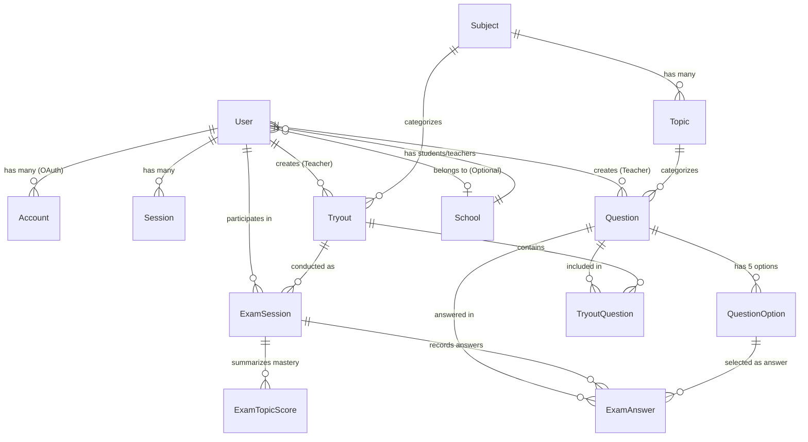

# BLUEPRINT 03: DATABASE DESIGN & ERD

**Project:** TryoutKu (Tryout Platform)  
**Version:** 0.1.0 (MVP)  
**Database Engine:** PostgreSQL (>= 15)  
**ORM:** Prisma ORM  
**Reference:** [BLUEPRINT 00.md](file:///mnt/data/VibeCoding/tryout-ku/BLUEPRINT%2000.md) & [rancangan.md](file:///mnt/data/VibeCoding/tryout-ku/rancangan.md)

---

## 1. Arsitektur Data & Keputusan Desain

Sistem Tryout dirancang dengan arsitektur **relasional modular** yang memenuhi prinsip:
1. **Account Linking:** Satu user bisa login melalui Email/Password maupun Google OAuth tanpa duplikasi akun.
2. **Bank Soal Mandiri (Reusable):** Satu soal di bank soal dapat dipakai berulang kali pada paket tryout yang berbeda melalui tabel relasi `TryoutQuestion`.
3. **Integritas Waktu Ujian (Server Authority):** Waktu berakhirnya ujian (`expiresAt`) dihitung dan divalidasi oleh server, bukan berdasarkan jam perangkat klien.
4. **Analitik Diagnostik Materi:** Setiap soal terhubung ke `Topic`/Materi pelajaran, memungkinkan kalkulasi penguasaan materi (*Mastery Analytics*) per peserta.
5. **Kerahasiaan Kunci Jawaban:** Kunci jawaban (`correctOptionId`) dipisahkan secara logis sehingga query saat pengerjaan tryout tidak membocorkan kunci dan pembahasan ke browser.

---

## 2. Entity Relationship Diagram (ERD)



---

## 3. Rincian Modul & Tabel

### A. Modul Identitas & Autentikasi (Auth & User Management)
Mendukung standar NextAuth.js / Auth.js v5 dan Account Linking.

* **`users`**: Entitas utama pengguna (Siswa, Guru, Admin).
* **`accounts`**: Penyimpanan akun provider eksternal (Google OAuth provider ID, access token, refresh token).
* **`sessions`**: Sesi login aktif berbasis database (opsional jika menggunakan JWT).
* **`verification_tokens`**: Token untuk verifikasi email dan reset password (*Forgot Password*).
* **`schools`**: Master data sekolah/institusi asal peserta.

### B. Modul Bank Soal & Kurikulum (Question Bank)
* **`subjects`**: Mata pelajaran (misal: Sosiologi, Matematika, Bahasa Indonesia).
* **`topics`**: Bab atau topik spesifik (misal: "Konflik Sosial", "Kelompok Sosial") untuk kebutuhan analitik diagnostik.
* **`questions`**: Induk soal, tingkat kesulitan (`EASY`, `MEDIUM`, `HARD`), teks soal, dan pembahasan.
* **`question_options`**: Opsi jawaban (label A, B, C, D, E) dan penanda kunci jawaban benar (`isCorrect`).

### C. Modul Paket Tryout (Tryout Management)
* **`tryouts`**: Paket ujian dengan durasi (menit), waktu mulai & selesai, KKM (`passingScore`), dan status publikasi.
* **`tryout_questions`**: Tabel pivot/penghubung yang mengatur urutan nomor soal (`orderNumber`) dan bobot nilai per soal (`weight`).

### D. Modul Pengerjaan Ujian & Nilai (Exam Engine & Scoring)
* **`exam_sessions`**: Sesi pengerjaan spesifik satu peserta pada satu tryout (`IN_PROGRESS`, `SUBMITTED`, `EXPIRED`), mencatat `startedAt`, `expiresAt`, nilai akhir, dan ringkasan benar/salah/kosong.
* **`exam_answers`**: Rekaman autosave jawaban peserta per nomor soal, opsi yang dipilih, flag ragu-ragu (`isFlagged`), dan poin yang didapat.
* **`exam_topic_scores`**: Tabel rekap agregasi hasil per materi (misal: Topik Konflik Sosial benar 9 dari 10 soal = 90%) untuk dashboard analitik siswa & guru.

---

## 4. Prisma Schema Lengkap (`schema.prisma`)

Berikut adalah definisi schema siap pakai untuk implementasi di project:

```prisma
// =============================================================================
// TRYOUT PLATFORM (TryoutKu) - PRISMA SCHEMA
// Engine: PostgreSQL
// =============================================================================

generator client {
  provider = "prisma-client-js"
}

datasource db {
  provider = "postgresql"
  url      = env("DATABASE_URL")
}

// -----------------------------------------------------------------------------
// ENUMS
// -----------------------------------------------------------------------------

enum UserRole {
  ADMIN
  TEACHER
  STUDENT
}

enum DifficultyLevel {
  EASY
  MEDIUM
  HARD
}

enum TryoutStatus {
  DRAFT
  PUBLISHED
  ARCHIVED
}

enum ExamSessionStatus {
  NOT_STARTED
  IN_PROGRESS
  SUBMITTED
  EXPIRED
}

enum DiscussionVisibility {
  ALWAYS
  AFTER_SUBMIT
  AFTER_TRYOUT_CLOSED
  NEVER
}

// -----------------------------------------------------------------------------
// 1. AUTHENTICATION & USER MANAGEMENT
// -----------------------------------------------------------------------------

model User {
  id            String    @id @default(cuid())
  name          String
  email         String    @unique
  emailVerified DateTime? @map("email_verified")
  passwordHash  String?   @map("password_hash") // null jika login murni OAuth
  image         String?
  role          UserRole  @default(STUDENT)
  phone         String?
  schoolClass   String?   @map("school_class") // contoh: "X IPA 1"
  
  // Relasi Sekolah (Opsional)
  schoolId      String?   @map("school_id")
  school        School?   @relation(fields: [schoolId], references: [id], onDelete: SetNull)

  // Auth Relations
  accounts      Account[]
  sessions      Session[]

  // Author Relations
  createdQuestions Question[]    @relation("TeacherQuestions")
  createdTryouts   Tryout[]      @relation("TeacherTryouts")

  // Activity Relations
  examSessions  ExamSession[]

  createdAt     DateTime  @default(now()) @map("created_at")
  updatedAt     DateTime  @updatedAt @map("updated_at")

  @@index([email])
  @@index([role])
  @@map("users")
}

model Account {
  id                String  @id @default(cuid())
  userId            String  @map("user_id")
  type              String
  provider          String
  providerAccountId String  @map("provider_account_id")
  refresh_token     String? @db.Text
  access_token      String? @db.Text
  expires_at        Int?
  token_type        String?
  scope             String?
  id_token          String? @db.Text
  session_state     String?

  user User @relation(fields: [userId], references: [id], onDelete: Cascade)

  @@unique([provider, providerAccountId])
  @@index([userId])
  @@map("accounts")
}

model Session {
  id           String   @id @default(cuid())
  sessionToken String   @unique @map("session_token")
  userId       String   @map("user_id")
  expires      DateTime
  user         User     @relation(fields: [userId], references: [id], onDelete: Cascade)

  @@index([userId])
  @@map("sessions")
}

model VerificationToken {
  identifier String
  token      String   @unique
  expires    DateTime

  @@unique([identifier, token])
  @@map("verification_tokens")
}

model School {
  id        String   @id @default(cuid())
  name      String
  npsn      String?  @unique
  address   String?
  city      String?
  province  String?
  isActive  Boolean  @default(true) @map("is_active")

  users     User[]

  createdAt DateTime @default(now()) @map("created_at")
  updatedAt DateTime @updatedAt @map("updated_at")

  @@map("schools")
}

// -----------------------------------------------------------------------------
// 2. QUESTION BANK & CURRICULUM
// -----------------------------------------------------------------------------

model Subject {
  id          String   @id @default(cuid())
  name        String   @unique // Contoh: "Sosiologi", "Matematika"
  code        String?  @unique // Contoh: "SOS", "MAT"
  description String?

  topics      Topic[]
  tryouts     Tryout[]

  createdAt   DateTime @default(now()) @map("created_at")
  updatedAt   DateTime @updatedAt @map("updated_at")

  @@map("subjects")
}

model Topic {
  id          String   @id @default(cuid())
  subjectId   String   @map("subject_id")
  name        String   // Contoh: "Konflik Sosial", "Aljabar"
  description String?

  subject     Subject      @relation(fields: [subjectId], references: [id], onDelete: Cascade)
  questions   Question[]
  topicScores ExamTopicScore[]

  createdAt   DateTime @default(now()) @map("created_at")
  updatedAt   DateTime @updatedAt @map("updated_at")

  @@unique([subjectId, name])
  @@index([subjectId])
  @@map("topics")
}

model Question {
  id           String          @id @default(cuid())
  topicId      String          @map("topic_id")
  createdById  String          @map("created_by_id")
  content      String          @db.Text // Teks soal (dapat berupa HTML/Markdown)
  imageUrl     String?         @map("image_url")
  difficulty   DifficultyLevel @default(MEDIUM)
  explanation  String?         @db.Text // Teks pembahasan soal
  explanationImageUrl String?  @map("explanation_image_url")
  isActive     Boolean         @default(true) @map("is_active")

  // Relasi
  topic        Topic           @relation(fields: [topicId], references: [id], onDelete: Restrict)
  author       User            @relation("TeacherQuestions", fields: [createdById], references: [id], onDelete: Restrict)
  options      QuestionOption[]
  inTryouts    TryoutQuestion[]
  examAnswers  ExamAnswer[]

  createdAt    DateTime        @default(now()) @map("created_at")
  updatedAt    DateTime        @updatedAt @map("updated_at")

  @@index([topicId])
  @@index([difficulty])
  @@map("questions")
}

model QuestionOption {
  id          String   @id @default(cuid())
  questionId  String   @map("question_id")
  label       String   // "A", "B", "C", "D", "E"
  content     String   @db.Text
  imageUrl    String?  @map("image_url")
  isCorrect   Boolean  @default(false) @map("is_correct") // Kunci jawaban

  question    Question @relation(fields: [questionId], references: [id], onDelete: Cascade)
  answersGiven ExamAnswer[]

  @@unique([questionId, label])
  @@index([questionId])
  @@map("question_options")
}

// -----------------------------------------------------------------------------
// 3. TRYOUT MANAGEMENT
// -----------------------------------------------------------------------------

model Tryout {
  id                   String               @id @default(cuid())
  title                String
  description          String?              @db.Text
  subjectId            String               @map("subject_id")
  createdById          String               @map("created_by_id")
  durationMinutes      Int                  @map("duration_minutes") // contoh: 60
  passingScore         Float                @default(75.0) @map("passing_score")
  status               TryoutStatus         @default(DRAFT)
  discussionVisibility DiscussionVisibility @default(AFTER_SUBMIT) @map("discussion_visibility")
  
  // Periode Akses (Opsional)
  startDate            DateTime?            @map("start_date")
  endDate              DateTime?            @map("end_date")

  // Relasi
  subject              Subject              @relation(fields: [subjectId], references: [id], onDelete: Restrict)
  author               User                 @relation("TeacherTryouts", fields: [createdById], references: [id], onDelete: Restrict)
  tryoutQuestions      TryoutQuestion[]
  examSessions         ExamSession[]

  createdAt            DateTime             @default(now()) @map("created_at")
  updatedAt            DateTime             @updatedAt @map("updated_at")

  @@index([subjectId])
  @@index([status])
  @@map("tryouts")
}

model TryoutQuestion {
  id          String   @id @default(cuid())
  tryoutId    String   @map("tryout_id")
  questionId  String   @map("question_id")
  orderNumber Int      @map("order_number") // Nomor urut soal: 1, 2, 3..
  weight      Float    @default(1.0)        // Bobot nilai soal (default 1)

  tryout      Tryout   @relation(fields: [tryoutId], references: [id], onDelete: Cascade)
  question    Question @relation(fields: [questionId], references: [id], onDelete: Cascade)

  @@unique([tryoutId, questionId])
  @@unique([tryoutId, orderNumber])
  @@index([tryoutId])
  @@map("tryout_questions")
}

// -----------------------------------------------------------------------------
// 4. EXAM ENGINE, SESSIONS & RESULTS
// -----------------------------------------------------------------------------

model ExamSession {
  id              String            @id @default(cuid())
  userId          String            @map("user_id")
  tryoutId        String            @map("tryout_id")
  status          ExamSessionStatus @default(IN_PROGRESS)
  
  // Waktu Otoritas Server
  startedAt       DateTime          @default(now()) @map("started_at")
  expiresAt       DateTime          @map("expires_at") // startedAt + durationMinutes
  submittedAt     DateTime?         @map("submitted_at")

  // Hasil & Skor Akhir
  totalScore      Float             @default(0.0) @map("total_score")
  correctCount    Int               @default(0)   @map("correct_count")
  wrongCount      Int               @default(0)   @map("wrong_count")
  unansweredCount Int               @default(0)   @map("unanswered_count")
  isPassed        Boolean           @default(false) @map("is_passed")

  // Relasi
  user            User              @relation(fields: [userId], references: [id], onDelete: Cascade)
  tryout          Tryout            @relation(fields: [tryoutId], references: [id], onDelete: Cascade)
  answers         ExamAnswer[]
  topicScores     ExamTopicScore[]

  createdAt       DateTime          @default(now()) @map("created_at")
  updatedAt       DateTime          @updatedAt @map("updated_at")

  @@index([userId, tryoutId])
  @@index([status])
  @@map("exam_sessions")
}

model ExamAnswer {
  id                 String          @id @default(cuid())
  examSessionId      String          @map("exam_session_id")
  questionId         String          @map("question_id")
  selectedOptionId   String?         @map("selected_option_id") // null jika belum dijawab
  isFlagged          Boolean         @default(false) @map("is_flagged") // Ragu-ragu
  
  // Evaluasi (Dihitung saat submit)
  isCorrect          Boolean         @default(false) @map("is_correct")
  scoreObtained      Float           @default(0.0) @map("score_obtained")
  answeredAt         DateTime?       @map("answered_at")

  // Relasi
  examSession        ExamSession     @relation(fields: [examSessionId], references: [id], onDelete: Cascade)
  question           Question        @relation(fields: [questionId], references: [id], onDelete: Cascade)
  selectedOption     QuestionOption? @relation(fields: [selectedOptionId], references: [id], onDelete: SetNull)

  createdAt          DateTime        @default(now()) @map("created_at")
  updatedAt          DateTime        @updatedAt @map("updated_at")

  @@unique([examSessionId, questionId])
  @@index([examSessionId])
  @@map("exam_answers")
}

model ExamTopicScore {
  id            String      @id @default(cuid())
  examSessionId String      @map("exam_session_id")
  topicId       String      @map("topic_id")
  correctCount  Int         @default(0) @map("correct_count")
  totalCount    Int         @default(0) @map("total_count")
  percentage    Float       @default(0.0) // (correctCount / totalCount) * 100

  examSession   ExamSession @relation(fields: [examSessionId], references: [id], onDelete: Cascade)
  topic         Topic       @relation(fields: [topicId], references: [id], onDelete: Cascade)

  @@unique([examSessionId, topicId])
  @@index([examSessionId])
  @@map("exam_topic_scores")
}
```

---

## 5. Panduan Implementasi & Integritas Data

1. **Inisialisasi Sesi Ujian (`ExamSession`):**
   * Saat siswa mengklik **"Mulai Tryout"**, sistem membuat record `ExamSession` dengan `startedAt = now()` dan `expiresAt = now() + tryout.durationMinutes`.
   * Sistem sekaligus membuat record kosong di `ExamAnswer` untuk setiap soal di tryout tersebut agar status nomor (belum dijawab/ragu-ragu) langsung siap ditampilkan.
2. **Autosave Jawaban:**
   * Setiap pergantian opsi mengirim patch ke endpoint: `PUT /api/exam-session/{id}/answer` dengan payload `{ questionId, selectedOptionId, isFlagged }`.
3. **Penyelesaian Ujian (Submit):**
   * Di-trigger oleh klik tombol **"Submit"** dari siswa, atau otomatis ketika server mendeteksi `now() >= expiresAt`.
   * Server mencocokkan `selectedOptionId` dengan `QuestionOption.isCorrect`.
   * Nilai total dihitung: $\text{Skor} = \frac{\sum \text{Score Obtained}}{\sum \text{Max Score}} \times 100$.
   * Agregasi skor per topik langsung dimasukkan ke tabel `ExamTopicScore` untuk keperluan diagnostik.
